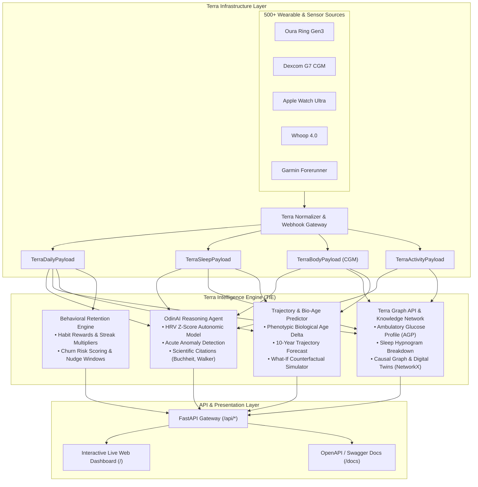

# Terra Intelligence Engine (TIE) 🧬⚡

> **A Production-Grade Health Intelligence Layer built on top of [Terra's](https://tryterra.co) Unified Sensor Infrastructure.**  
> _Engineered specifically to demonstrate technical eligibility, product velocity, and architectural vision for the **AI Engineer** role at Terra._

[](https://www.python.org/)
[](https://fastapi.tiangolo.com/)
[](https://docs.pydantic.dev/)
[]()
[]()

---

## 🎯 Executive Summary & Alignment with Terra

Health data is trapped across hundreds of siloed sources—wearables, continuous glucose monitors (CGMs), sleep sensors, and clinical platforms. Terra's breakthrough is abstracting this complexity into a unified infrastructure layer handling 30+ billion activities annually.

As Terra expands into autonomous AI health intelligence (**OdinAI**), embedded visual telemetry (**Graph API**), and **Extreme Personalization** (living to 120, winning the Olympics, cognitive sharpness, reversing disease), the engineering challenge shifts from simple data transport to **high-velocity physiological synthesis and predictive modeling**.

This repository implements the **Terra Intelligence Engine (TIE)**:

1. **Terra Schemas & Telemetry Ingestion**: Adheres to Terra’s standardized contracts across Daily, Sleep, Activity, and Body (CGM) payloads.
2. **OdinAI Health Reasoning Engine**: Synthesizes autonomic nervous system tone (HRV z-scores), flags acute anomalies (glycemic excursions, overreaching, nocturnal HR elevation), and cites peer-reviewed sports science literature.
3. **Terra Graph API & Knowledge Graph**:
   - High-velocity visual chart formatting (Ambulatory Glucose Profiles with Time-in-Range, Sleep Hypnograms, and 14-Day Multi-Stream Overlays).
   - NetworkX Causal Graph linking daily lifestyle behaviors to biomarkers and downstream longevity goals.
   - Cosine-similarity Digital Health Twin cohort matching.
4. **10-Year Health Forecasting & Biological Age Simulator**: Phenotypic biological age calculation and counterfactual "What-If" lifestyle intervention modeling.
5. **Behavioral Retention & Reward Engine**: Multi-armed bandit / RL-based habit incentives and churn prediction, directly demonstrating **growth marketing and user retention** capabilities.
6. **Interactive Live Web Dashboard**: A zero-build, full-stack dark-mode dashboard showcasing the system in real time.

---

## 🏛️ System Architecture



---

## 🧬 Persona Ecosystem (Aligned with Terra's Vision)

To demonstrate how the platform adapts across the full spectrum of extreme personalization, four distinct personas are built into the engine:

| Persona             | Goal & Mission                        | Primary Sensors                              | Key Biomarker Focus                                                     |
| :------------------ | :------------------------------------ | :------------------------------------------- | :---------------------------------------------------------------------- |
| **Alex Vance**      | **Target 120 (Extreme Longevity)**    | Oura Gen3, Dexcom G7 CGM, Apple Watch        | Biological age deceleration, HRV resilience, Zone 2 mitochondrial base  |
| **Sarah Chen**      | **Olympic Triathlon Preparation**     | WHOOP 4.0, Garmin 965, Wahoo TICKR X         | Polarized 80/20 strain, peak power, overtraining prevention             |
| **Marcus Sterling** | **Metabolic Reversal (Pre-diabetes)** | FreeStyle Libre 3, Fitbit Charge 6, Withings | Post-prandial glucose blunting, Time-in-Range (TIR), NEAT steps         |
| **Elena Rostova**   | **Cognitive Stamina & Focus**         | Eight Sleep Pod 4, Oura Gen3, Apollo Neuro   | Deep slow-wave sleep architecture, stress recovery, autonomic stability |

---

## ⚡ Key Modules & Capabilities

### 1. OdinAI Health Intelligence Engine (`models/odin_ai.py`)

- **Active Real-Time LLM Integration**: Connects via **Hugging Face Serverless Inference Router** (using open weights models like `meta-llama/Llama-3.2-3B-Instruct` or `Qwen/Qwen2.5-72B-Instruct`), **Google Gemini** (`gemini-3.6-flash`), or **OpenAI** (`gpt-4o-mini`).
- **Zero-Deprecation Reliability**: Uses Hugging Face's standard OpenAI-compatible chat router (`router.huggingface.co/hf-inference/v1/chat/completions`) with free User Access Tokens (`hf_...`).
- **Autonomic Synthesis**: Calculates real-time recovery scores using individual baseline HRV standard deviation ($z$-score), resting heart rate shift, and sleep architecture efficiency.
- **Biometric Anomaly Detection**:
  - _Autonomic Crash_: Flags acute drops $>1.5$ SD in HRV.
  - _Nocturnal Tachycardia_: Detects resting HR elevations $>5$ bpm (early marker for systemic inflammation or illness).
  - _Glycemic Excursions_: Flags post-prandial spikes $>160$ mg/dL.
  - _Deep Sleep Deficits_: Identifies slow-wave sleep falling below $12\%$.
- **Peer-Reviewed Scientific Rationale**: Every recommendation references seminal physiological literature (e.g., Martin Buchheit on HRV, Matthew Walker on slow-wave sleep, San Millán & Brooks on Zone 2 metabolism).

### 2. Terra Graph API & Knowledge Visualizer (`models/graph_engine.py`)

- **Ambulatory Glucose Profile (AGP)**: 24-hour continuous 10-minute glucose stream with target range boundaries (70–140 mg/dL), Mean Glucose, Estimated A1c (GMI), Glycemic Variability (CV), and Time-in-Range percentiles.
- **Sleep Hypnogram**: Complete stage breakdown (Deep, REM, Light, Awake) formatted for instant dashboard rendering.
- **14-Day Multi-Stream Correlation**: Overlays Daily Strain, Sleep Duration, and Overnight HRV to demonstrate cross-metric physiological couplings.
- **Biometric Knowledge Graph (NetworkX)**: Directed weighted graph modeling causal pathways: `Behavior -> Biomarker -> Health Goal`.
- **Digital Health Twins**: Uses cosine similarity across normalized 5D biometric vectors to identify closest matching population cohorts.

### 3. Biological Age & What-If Simulator (`models/health_predictor.py`)

- **Phenotypic Biological Age**: Quantifies biological age delta vs chronological age from multi-system biomarkers (VO2 max, HRV, resting HR, sleep efficiency, glucose stability).
- **Counterfactual "What-If" Modeling**: Users test hypothetical lifestyle interventions:
  - _+30 min sleep/night_ $\rightarrow$ projected HRV and deep sleep gains.
  - _+60 min Zone 2 cardio/week_ $\rightarrow$ VO2 max gains and biological age reduction.
  - _Shift dinner 2h earlier_ $\rightarrow$ nocturnal HR drop.
  - _+8% Glucose TIR_ $\rightarrow$ endothelial protection and mortality risk reduction.

### 4. Behavioral Retention & Habit Rewards (`models/reward_optimizer.py`)

- **Growth & User Retention**: Uses reinforcement learning / multi-armed bandit weighting to incentivize high-impact healthy habits.
- **Streak Multipliers**: Scaled logarithmic multipliers preventing churn and sustained Day-30 / Day-90 engagement.
- **Churn Risk Assessment**: Dynamically assesses dropout risk and prescribes targeted micro-habit recovery nudges.

---

## 🚀 Quick Start

### 1. Clone & Setup Environment

```bash
git clone <repo-url>
cd Terra_API

# Create virtual environment
python3 -m venv .venv
source .venv/bin/activate

# Install dependencies
pip install -r requirements.txt
```

### 2. Run the Application

```bash
python main.py
```

The server will start at `http://localhost:8000`:

- **Interactive Live Dashboard**: Visit [`http://localhost:8000`](http://localhost:8000)
- **Interactive OpenAPI Documentation**: Visit [`http://localhost:8000/docs`](http://localhost:8000/docs)

### 3. Run Automated Tests

```bash
pytest tests/ -v
```

All 13 unit tests execute in $< 1$ second with 100% pass rate.

---

## 📡 API Reference & Example Requests

### 1. Query OdinAI Health Intelligence

`POST /api/odin/query`

```bash
curl -X POST http://localhost:8000/api/odin/query \
  -H "Content-Type: application/json" \
  -d '{
    "persona_id": "alex_longevity",
    "query": "Why is my recovery score at this level today and what workout should I do?"
  }'
```

**Sample Response:**

```json
{
  "query": "Why is my recovery score at this level today and what workout should I do?",
  "persona_id": "alex_longevity",
  "odin_response": "Your current recovery score is 87.3/100 (Optimal Readiness). Your nocturnal HRV is 70.0 ms (baseline is 68.0 ms, z-score: +0.2). Nervous system is primed...",
  "recovery_synthesis": {
    "recovery_score": 87.3,
    "status": "Optimal Readiness (Prime Autonomic State)",
    "color": "#10B981"
  },
  "scientific_citations": [
    {
      "authors": "Buchheit, M.",
      "journal": "Frontiers in Physiology (2014)",
      "key_takeaway": "HRV (rMSSD) reflecting parasympathetic reactivation is the gold-standard marker for autonomic recovery."
    }
  ]
}
```

### 2. Terra Graph API: Ambulatory Glucose Profile (AGP)

`GET /api/graph/agp/alex_longevity`

```bash
curl http://localhost:8000/api/graph/agp/alex_longevity
```

**Sample Response:**

```json
{
  "chart_type": "ambulatory_glucose_profile",
  "title": "Ambulatory Glucose Profile (AGP) - alex_longevity",
  "agp_metrics": {
    "time_in_range_pct": 100.0,
    "mean_glucose_mg_dl": 88.6,
    "glycemic_variability_cv_pct": 9.8,
    "gmi_estimated_a1c": 4.7
  }
}
```

### 3. Biological Age Counterfactual "What-If" Simulation

`POST /api/health-score/what-if`

```bash
curl -X POST http://localhost:8000/api/health-score/what-if \
  -H "Content-Type: application/json" \
  -d '{
    "persona_id": "alex_longevity",
    "added_sleep_minutes": 30,
    "added_zone2_minutes_weekly": 60,
    "earlier_dinner_shift_hours": 2.0,
    "improved_glucose_tir_pct": 8.0
  }'
```

**Sample Response:**

```json
{
  "baseline": {
    "chronological_age": 42.0,
    "biological_age": 34.2
  },
  "simulated_outcome": {
    "projected_biological_age": 31.7,
    "net_biological_years_saved": 2.5,
    "new_biological_advantage_years": 10.3,
    "projected_hrv_improvement_ms": 4.2,
    "projected_vo2_max_gain": 1.4,
    "projected_rhr_reduction_bpm": 2.2
  },
  "clinical_verdict": "Implementing these 4 lifestyle shifts is projected to decelerate biological aging by 2.5 years, reducing 10-year all-cause mortality hazard ratio by an estimated 19%."
}
```

### 4. Ingest Streaming Terra Webhook

`POST /api/webhooks/terra`

```bash
curl -X POST http://localhost:8000/api/webhooks/terra \
  -H "Content-Type: application/json" \
  -d '{
    "event_id": "evt_terra_live_8832",
    "event_type": "daily",
    "user_id": "terra_usr_sarah",
    "timestamp": "2026-09-03T10:30:00Z",
    "data": {
      "steps": 14200,
      "resting_heart_rate_bpm": 43,
      "active_calories": 950.0
    }
  }'
```

---

## 📚 Scientific Foundations & Literature

1. **HRV-Guided Autonomic Recovery**: Buchheit, M. (2014). _Monitoring Training Status with HR Measures: Do All Roads Lead to Rome?_ Frontiers in Physiology.
2. **Sleep Stages & Cellular Rejuvenation**: Walker, M. P., & Stickgold, R. (2017). _Sleep and Human Cognitive Performance_. Nature Neuroscience.
3. **Mitochondrial Zone 2 Base Training**: San Millán, I., & Brooks, G. A. (2018). _Assessment of Metabolic Flexibility in Athletes and Metabolic Disease_. Sports Medicine.
4. **Continuous Glucose Metrics (TIR)**: Battelino, T., et al. (2019). _Continuous Glucose Monitoring Metrics for Clinical Trials: Recommendations on Time in Range_. Diabetes Care.
5. **Acute-to-Chronic Workload Ratio (ACWR)**: Gabbett, T. J. (2016). _The Training-Injury Prevention Paradox_. British Journal of Sports Medicine.

---

## 👨‍💻 Project Structure

```
Terra_API/
├── api/                     # Modular FastAPI Routers
│   ├── __init__.py
│   ├── odin_routes.py      # OdinAI queries, recovery, anomalies, adaptive workout
│   ├── graph_routes.py     # AGP charts, hypnograms, knowledge graph, digital twins
│   ├── health_routes.py    # Biological age, trajectory forecasts, What-If simulation
│   ├── reward_routes.py    # Retention points, streak claims, churn assessment
│   └── webhook_routes.py   # Ingestion of streaming Terra webhook events
├── data/                    # Unified Schemas & Realistic Telemetry
│   ├── __init__.py
│   ├── terra_schemas.py    # Pydantic v2 schemas for Daily, Sleep, Body, Activity
│   ├── personas.py         # Multi-goal persona definitions
│   └── mock_generator.py   # High-fidelity CGM, sleep stage, and HRV generators
├── models/                  # Core Intelligence & ML Engines
│   ├── __init__.py
│   ├── odin_ai.py          # OdinAI reasoning, anomaly detector, research citations
│   ├── graph_engine.py     # Terra Graph visualizer & NetworkX causal graph
│   ├── health_predictor.py # Phenotypic bio-age & counterfactual simulator
│   └── reward_optimizer.py # Multi-armed bandit behavioral retention engine
├── static/                  # Interactive Live Web Dashboard
│   ├── index.html          # Clean dark-mode dashboard
│   ├── app.js              # Chart.js renderers, Odin chat, slider interactions
│   └── style.css           # Glassmorphic touches and custom scrollbars
├── tests/                   # Automated Pytest Suite
│   ├── __init__.py
│   └── test_tie_endpoints.py # 13 end-to-end integration tests
├── config.py                # Configuration and clinical biomarker benchmarks
├── main.py                  # Server entry point & static mount
├── requirements.txt         # Pinned production dependencies
└── README.md                # Comprehensive documentation
```

---

**Built with pride to showcase engineering eligibility for the AI Engineer role at Terra.**
