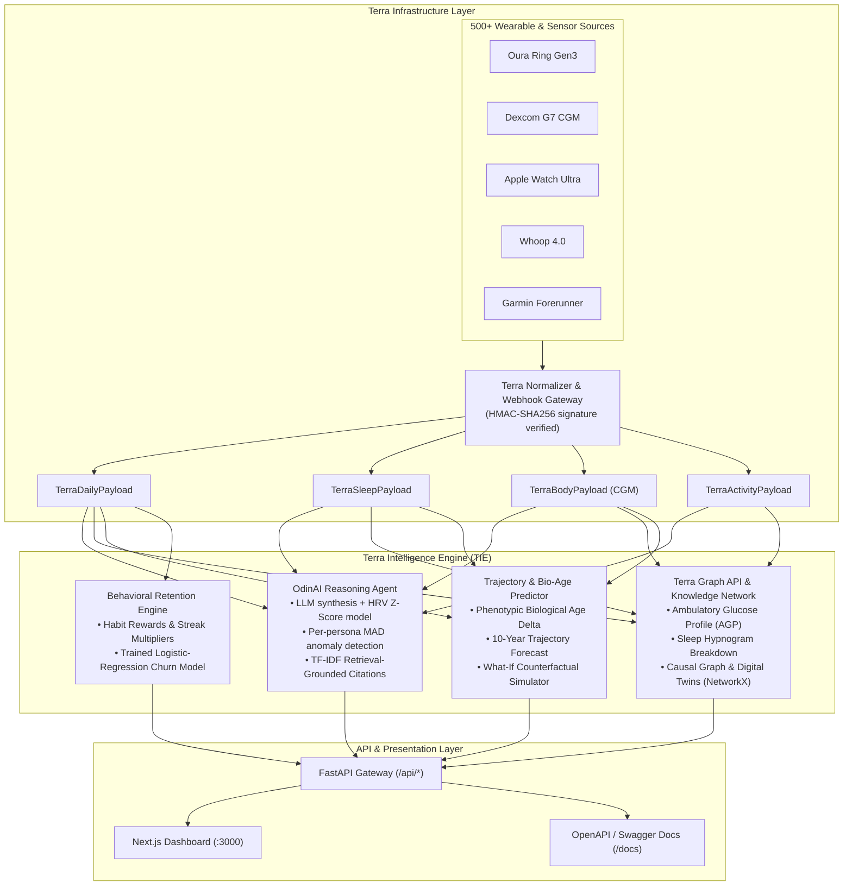

# Terra Intelligence Engine (TIE) 🧬⚡

> **A Production-Grade Health Intelligence Layer built on top of [Terra's](https://tryterra.co) Unified Sensor Infrastructure.**  
> _Engineered specifically to demonstrate technical eligibility, product velocity, and architectural vision for the **AI Engineer** role at Terra._

[](https://www.python.org/)
[](https://fastapi.tiangolo.com/)
[](https://nextjs.org/)
[](https://docs.pydantic.dev/)
[]()
[](LICENSE)

---

## 🎯 Executive Summary & Alignment with Terra

Health data is trapped across hundreds of siloed sources—wearables, continuous glucose monitors (CGMs), sleep sensors, and clinical platforms. Terra's breakthrough is abstracting this complexity into a unified infrastructure layer handling 30+ billion activities annually.

As Terra expands into autonomous AI health intelligence (**OdinAI**), embedded visual telemetry (**Graph API**), and **Extreme Personalization** (living to 120, winning the Olympics, cognitive sharpness, reversing disease), the engineering challenge shifts from simple data transport to **high-velocity physiological synthesis and predictive modeling**.

This repository implements the **Terra Intelligence Engine (TIE)**:

1. **Terra Schemas & Telemetry Ingestion**: Adheres to Terra's standardized contracts across Daily, Sleep, Activity, and Body (CGM) payloads, ingested through a webhook gateway with real HMAC-SHA256 signature verification.
2. **OdinAI Health Reasoning Engine**: LLM-backed synthesis of autonomic nervous system tone (HRV z-scores), retrieval-grounded scientific citations, and a deterministic eval harness with versioned prompts.
3. **Real, Benchmarked ML Models**: a per-persona statistical anomaly detector (median/MAD control chart + secondary IsolationForest) and a trained logistic-regression churn/retention classifier — each evaluated against the naive heuristic it replaced, with the honest before/after numbers documented in [`docs/ML_DESIGN.md`](docs/ML_DESIGN.md).
4. **Terra Graph API & Knowledge Graph**:
   - High-velocity visual chart formatting (Ambulatory Glucose Profiles with Time-in-Range, Sleep Hypnograms, and 14-Day Multi-Stream Overlays).
   - NetworkX Causal Graph linking daily lifestyle behaviors to biomarkers and downstream longevity goals.
   - Cosine-similarity Digital Health Twin cohort matching.
5. **10-Year Health Forecasting & Biological Age Simulator**: Phenotypic biological age calculation and counterfactual "What-If" lifestyle intervention modeling.
6. **Behavioral Retention & Reward Engine**: habit-streak incentives paired with the trained churn classifier, directly demonstrating **growth marketing and user retention** capabilities.
7. **Next.js Dashboard**: a full-stack dark-mode dashboard (5 tabs: overview, longevity, habits, graphs, OdinAI) served as its own process against the FastAPI backend.

---

## 🏛️ System Architecture



---

## 🧬 Persona Ecosystem (Aligned with Terra's Vision)

To demonstrate how the platform adapts across the full spectrum of extreme personalization, four distinct personas are built into the engine:

| Persona             | Goal & Mission                        | Primary Sensors                              | Key Biomarker Focus                                                     |
| :------------------ | :------------------------------------ | :------------------------------------------- | :---------------------------------------------------------------------- |
| **Alex Vance**      | **Target 120 (Extreme Longevity)**    | Oura Gen3, Dexcom G7 CGM, Apple Watch        | Biological age deceleration, HRV resilience, Zone 2 mitochondrial base  |
| **Sarah Chen**      | **Olympic Triathlon Preparation**     | WHOOP 4.0, Garmin 965, Wahoo TICKR X         | Polarized 80/20 strain, peak power, overtraining prevention             |
| **Marcus Sterling** | **Metabolic Reversal (Pre-diabetes)** | FreeStyle Libre 3, Fitbit Charge 6, Withings | Post-prandial glucose blunting, Time-in-Range (TIR), NEAT steps         |
| **Elena Rostova**   | **Cognitive Stamina & Focus**         | Eight Sleep Pod 4, Oura Gen3, Apollo Neuro   | Deep slow-wave sleep architecture, stress recovery, autonomic stability |

---

## ⚡ Key Modules & Capabilities

### 1. OdinAI Health Intelligence Engine (`models/odin_ai.py`, `prompts/`, `evals/`)

- **Active Real-Time LLM Integration**: Connects via **Hugging Face Serverless Inference Router** (default), **Google Gemini**, or **OpenAI**, with a deterministic heuristic fallback when no live key is configured (`is_live_ai: false` in the response, so it's never silently hidden).
- **Versioned Prompts**: `prompts/odin_prompts.py` holds a `PROMPTS = {"v1": ..., "v2": ...}` registry — the current `PROMPT_VERSION` is surfaced in API responses so a prompt change is traceable.
- **Retrieval-Grounded Citations**: `models/citation_retriever.py` ranks a 48-entry corpus of real, independently verifiable peer-reviewed references (`data/citations_corpus.json`) via TF-IDF + cosine similarity, with an optional Hugging Face embeddings tier as a secondary upgrade.
- **Deterministic Eval Harness** (`evals/run_eval.py`): ~32 golden queries checked for numeric grounding against real telemetry, citation validity against the corpus, and safe scope handling — plus a small, explicitly secondary LLM-as-judge tier. `evals/compare_reports.py` diffs two prompt-version runs. Full methodology and results: [`docs/ML_DESIGN.md`](docs/ML_DESIGN.md#3-llm-eval-harness--prompt-versioning).
- **Autonomic Synthesis**: real-time recovery scores from individual baseline HRV z-score, resting heart rate shift, and sleep architecture efficiency.

### 2. Statistical Anomaly Detection (`models/anomaly_detector.py`, `training/train_anomaly_baselines.py`)

- **Per-persona median/MAD control chart** (Iglewicz & Hoaglin modified z-score, `|z| > 3.5` over a trailing 14-21 day window) replaces the old one-size-fits-all fixed threshold.
- **Secondary IsolationForest** layer over rolling engineered features catches correlated multi-metric drift a single-metric check misses — kept secondary since a heavier multivariate model isn't the right primary tool at this N.
- Evaluated against injected synthetic events (illness/travel/overtraining/alcohol) with documented ground truth; the honest, non-cherry-picked before/after table is in [`docs/ML_DESIGN.md`](docs/ML_DESIGN.md#1-anomaly-detection--per-persona-mad-control-chart).

### 3. Retention & Churn Classifier (`models/churn_model.py`, `training/train_churn_model.py`)

- **Trained logistic regression** (benchmarked against `HistGradientBoostingClassifier`) predicting 30-day churn from trailing engagement, streak, recovery-trend, and anomaly-flag features — all strictly backward-looking from the label cutoff.
- Fit on a purpose-built synthetic engagement simulator (`data/engagement_simulator.py`) whose independent-noise design deliberately bounds AUC to 0.70-0.85, so the model can't just invert its own label generator.
- **0.834 ROC-AUC vs. 0.514 for the existing `RewardOptimizer` heuristic it sits alongside** — full temporal-holdout and leave-one-persona-out results in [`docs/ML_DESIGN.md`](docs/ML_DESIGN.md#2-churnretention-classifier).

### 4. Terra Graph API & Knowledge Visualizer (`models/graph_engine.py`)

- **Ambulatory Glucose Profile (AGP)**: 24-hour continuous 10-minute glucose stream with target range boundaries (70–140 mg/dL), Mean Glucose, Estimated A1c (GMI), Glycemic Variability (CV), and Time-in-Range percentiles.
- **Sleep Hypnogram**: Complete stage breakdown (Deep, REM, Light, Awake) formatted for instant dashboard rendering.
- **14-Day Multi-Stream Correlation**: Overlays Daily Strain, Sleep Duration, and Overnight HRV to demonstrate cross-metric physiological couplings.
- **Biometric Knowledge Graph (NetworkX)**: Directed weighted graph modeling causal pathways: `Behavior -> Biomarker -> Health Goal`.
- **Digital Health Twins**: Uses cosine similarity across normalized 5D biometric vectors to identify closest matching population cohorts.

### 5. Biological Age & What-If Simulator (`models/health_predictor.py`)

- **Phenotypic Biological Age**: Quantifies biological age delta vs chronological age from multi-system biomarkers (VO2 max, HRV, resting HR, sleep efficiency, glucose stability).
- **Counterfactual "What-If" Modeling**: users test hypothetical lifestyle interventions (added sleep, added Zone 2 cardio, an earlier dinner shift, improved glucose TIR) and see the projected biological-age impact.
- This module is coefficient-based, not fit to data — it's flagged here deliberately rather than dressed up, in the same honest spirit as the rest of this document.

### 6. Terra Webhook Ingestion (`api/webhook_routes.py`, `security/terra_signature.py`)

- Implements Terra's actual documented `terra-signature: t=<ts>,v1=<hex_hmac>` scheme: HMAC-SHA256 over `"{timestamp}.{raw_body}"`, constant-time compared, verified against the **raw** request body, trusting only the `v1` scheme (other prefixes are ignored to prevent a downgrade bypass).
- Enforced whenever `TERRA_SIGNING_SECRET` is configured; returns `401` on a missing/invalid signature. See `tests/test_terra_signature.py` and `tests/test_tie_endpoints.py`'s signed/forged webhook tests.

---

## 🚀 Quick Start

### Option A — Docker Compose (fastest, one command)

```bash
git clone <repo-url>
cd Terra_API
docker compose up --build
```

- Backend: [`http://localhost:8000`](http://localhost:8000) ([`/docs`](http://localhost:8000/docs) for Swagger)
- Frontend dashboard: [`http://localhost:3000`](http://localhost:3000)

### Option B — Run locally (two processes)

**1. Backend (FastAPI)**

```bash
python3 -m venv .venv
source .venv/bin/activate
pip install -r requirements.txt
cp .env.example .env   # fill in HUGGINGFACE_API_KEY (optional) and TERRA_SIGNING_SECRET (optional)
python main.py
```

Backend runs at `http://localhost:8000` (`/docs` for Swagger/OpenAPI).

**2. Frontend (Next.js dashboard)**

```bash
cd frontend
cp .env.local.example .env.local
pnpm install
pnpm dev
```

Dashboard runs at `http://localhost:3000` and proxies `/api/*` calls to the FastAPI backend.

### Run Automated Tests

```bash
pytest tests/ -v
```

All 50 unit + integration tests execute in under 2 seconds with 100% pass rate.

### Regenerate ML Artifacts & Eval Reports

```bash
python training/train_anomaly_baselines.py
python training/train_churn_model.py
python -m evals.run_eval
```

See [`docs/ML_DESIGN.md`](docs/ML_DESIGN.md) for what each of these produces and why.

---

## 📡 API Reference & Example Requests

### 1. Query OdinAI Health Intelligence

`POST /api/odin/query`

```bash
curl -X POST http://localhost:8000/api/odin/query \
  -H "Content-Type: application/json" \
  -d '{
    "persona_id": "alex_longevity",
    "query": "Why is my recovery score at this level today and what workout should I do?"
  }'
```

**Sample Response:**

```json
{
  "query": "Why is my recovery score at this level today and what workout should I do?",
  "persona_id": "alex_longevity",
  "odin_response": "Your current recovery score is 87.3/100 (Optimal Readiness). Your nocturnal HRV is 70.0 ms (baseline is 68.0 ms, z-score: +0.2). Nervous system is primed...",
  "recovery_synthesis": {
    "recovery_score": 87.3,
    "status": "Optimal Readiness (Prime Autonomic State)",
    "color": "#10B981"
  },
  "scientific_citations": [
    {
      "authors": "Buchheit, M.",
      "journal": "Frontiers in Physiology (2014)",
      "key_takeaway": "HRV (rMSSD) reflecting parasympathetic reactivation is the gold-standard marker for autonomic recovery."
    }
  ]
}
```

### 2. Terra Graph API: Ambulatory Glucose Profile (AGP)

`GET /api/graph/agp/alex_longevity`

```bash
curl http://localhost:8000/api/graph/agp/alex_longevity
```

**Sample Response:**

```json
{
  "chart_type": "ambulatory_glucose_profile",
  "title": "Ambulatory Glucose Profile (AGP) - alex_longevity",
  "agp_metrics": {
    "time_in_range_pct": 100.0,
    "mean_glucose_mg_dl": 88.6,
    "glycemic_variability_cv_pct": 9.8,
    "gmi_estimated_a1c": 4.7
  }
}
```

### 3. Biological Age Counterfactual "What-If" Simulation

`POST /api/health-score/what-if`

```bash
curl -X POST http://localhost:8000/api/health-score/what-if \
  -H "Content-Type: application/json" \
  -d '{
    "persona_id": "alex_longevity",
    "added_sleep_minutes": 30,
    "added_zone2_minutes_weekly": 60,
    "earlier_dinner_shift_hours": 2.0,
    "improved_glucose_tir_pct": 8.0
  }'
```

**Sample Response:**

```json
{
  "baseline": {
    "chronological_age": 42.0,
    "biological_age": 34.2
  },
  "simulated_outcome": {
    "projected_biological_age": 31.7,
    "net_biological_years_saved": 2.5,
    "new_biological_advantage_years": 10.3,
    "projected_hrv_improvement_ms": 4.2,
    "projected_vo2_max_gain": 1.4,
    "projected_rhr_reduction_bpm": 2.2
  },
  "clinical_verdict": "Implementing these 4 lifestyle shifts is projected to decelerate biological aging by 2.5 years, reducing 10-year all-cause mortality hazard ratio by an estimated 19%."
}
```

### 4. Ingest a Signed Terra Webhook

`POST /api/webhooks/terra`

When `TERRA_SIGNING_SECRET` is set, requests must carry a valid `terra-signature` header
(unsigned requests are accepted only when no secret is configured, for local/dev use):

```bash
BODY='{"event_id":"evt_terra_live_8832","event_type":"daily","user_id":"terra_usr_sarah","timestamp":"2026-09-03T10:30:00Z","data":{"steps":14200,"resting_heart_rate_bpm":43,"active_calories":950.0}}'
TS=$(date +%s)
SIG=$(printf '%s.%s' "$TS" "$BODY" | openssl dgst -sha256 -hmac "$TERRA_SIGNING_SECRET" | sed 's/^.* //')

curl -X POST http://localhost:8000/api/webhooks/terra \
  -H "Content-Type: application/json" \
  -H "terra-signature: t=${TS},v1=${SIG}" \
  -d "$BODY"
```

---

## 🎯 How This Maps to the Terra AI Engineer Role

The [Terra AI Engineer posting](https://tryterra.co) asks for someone "creating, testing, and implementing AI models," doing "data analysis, machine learning, and natural language processing," "fine-tuning AI performance metrics," with growth-marketing/retention experience as a plus. Mapped directly to what's shipped here:

| Job posting language | What's in this repo |
| :--- | :--- |
| Creating & implementing AI models | Per-persona MAD anomaly detector + secondary IsolationForest (`models/anomaly_detector.py`); trained logistic-regression churn classifier benchmarked against HistGradientBoosting (`models/churn_model.py`) |
| Testing AI models / fine-tuning AI performance metrics | Deterministic LLM eval harness with numeric-grounding, citation-validity, and scope checks; versioned prompts with before/after report diffing (`evals/`, `prompts/`) |
| Data analysis & machine learning | Synthetic longitudinal + engagement simulators purpose-built to give the above models real data to train and evaluate on, with documented generative assumptions (`data/`, [`docs/ML_DESIGN.md`](docs/ML_DESIGN.md)) |
| Natural language processing | TF-IDF retrieval-grounded scientific citation engine over a 48-entry verified corpus, with an optional embeddings upgrade tier (`models/citation_retriever.py`) |
| Growth-marketing / retention experience | Churn model quantifying a 0.834 vs. 0.514 AUC lift over the existing retention heuristic, wired into `reward_optimizer.py` alongside (not silently replacing) that heuristic |

`docs/ML_DESIGN.md` is where each of these is defended in full, including the honest
caveats (synthetic data, small-N, a deliberately bounded AUC) — because being able to
explain those caveats fluently is itself part of the answer.

---

## 📚 Scientific Foundations & Literature

`data/citations_corpus.json` holds 48 real, independently verifiable peer-reviewed references retrieved by `models/citation_retriever.py`. A representative sample:

1. **HRV-Guided Autonomic Recovery**: Buchheit, M. (2014). _Monitoring Training Status with HR Measures: Do All Roads Lead to Rome?_ Frontiers in Physiology.
2. **Sleep Stages & Cellular Rejuvenation**: Walker, M. P., & Stickgold, R. (2017). _Sleep and Human Cognitive Performance_. Nature Neuroscience.
3. **Mitochondrial Zone 2 Base Training**: San Millán, I., & Brooks, G. A. (2018). _Assessment of Metabolic Flexibility in Athletes and Metabolic Disease_. Sports Medicine.
4. **Continuous Glucose Metrics (TIR)**: Battelino, T., et al. (2019). _Continuous Glucose Monitoring Metrics for Clinical Trials: Recommendations on Time in Range_. Diabetes Care.
5. **Acute-to-Chronic Workload Ratio (ACWR)**: Gabbett, T. J. (2016). _The Training-Injury Prevention Paradox_. British Journal of Sports Medicine.
6. **Robust Anomaly Detection**: Iglewicz, B., & Hoaglin, D. C. (1993). _How to Detect and Handle Outliers_. ASQC Quality Press. (the modified z-score/MAD method behind `models/anomaly_detector.py`)

---

## 👨‍💻 Project Structure

```
Terra_API/
├── api/                       # Modular FastAPI Routers
│   ├── odin_routes.py        # OdinAI queries, recovery, anomalies, adaptive workout
│   ├── graph_routes.py       # AGP charts, hypnograms, knowledge graph, digital twins
│   ├── health_routes.py      # Biological age, trajectory forecasts, What-If simulation
│   ├── reward_routes.py      # Retention points, streak claims, churn assessment
│   └── webhook_routes.py     # Terra webhook ingestion + HMAC signature verification
├── security/
│   └── terra_signature.py    # Terra's terra-signature HMAC-SHA256 verify/sign helpers
├── data/                      # Unified schemas & synthetic telemetry generation
│   ├── terra_schemas.py      # Pydantic v2 schemas for Daily, Sleep, Body, Activity
│   ├── personas.py           # Multi-goal persona definitions
│   ├── mock_generator.py     # High-fidelity CGM, sleep stage, and HRV generators
│   ├── persona_archetypes.py # Population-level sampling around each persona baseline
│   ├── longitudinal_simulator.py # AR(1) + seasonality + injected life-event log
│   ├── engagement_simulator.py   # Habit-strength random walk -> churn labels
│   └── citations_corpus.json # 48 verified peer-reviewed references
├── models/                    # Core intelligence & ML engines
│   ├── odin_ai.py            # OdinAI reasoning + LLM passthrough
│   ├── anomaly_detector.py   # Per-persona MAD control chart + IsolationForest
│   ├── churn_model.py        # Trained logistic-regression retention classifier
│   ├── citation_retriever.py # TF-IDF retrieval over the citations corpus
│   ├── graph_engine.py       # Terra Graph visualizer & NetworkX causal graph
│   ├── health_predictor.py   # Phenotypic bio-age & counterfactual simulator
│   ├── reward_optimizer.py   # Habit rewards + churn-model-backed retention analytics
│   └── artifacts/            # Trained model artifacts (baselines, joblib files)
├── training/                  # Model training/evaluation scripts + reports
│   ├── train_anomaly_baselines.py
│   ├── train_churn_model.py
│   └── reports/               # Committed before/after metrics (JSON + Markdown)
├── prompts/
│   └── odin_prompts.py       # Versioned OdinAI system-prompt registry
├── evals/                     # Deterministic LLM eval harness
│   ├── golden_queries.json
│   ├── run_eval.py
│   └── compare_reports.py
├── frontend/                   # Next.js 16 dashboard (its own process, :3000)
│   ├── app/, components/, hooks/, lib/, store/, types/
│   └── Dockerfile
├── archive/legacy-static-dashboard/  # Pre-Next.js zero-build dashboard (kept for history)
├── docs/
│   └── ML_DESIGN.md          # Full ML methodology, honesty caveats, before/after tables
├── tests/                     # Automated Pytest suite (50 tests)
├── .github/workflows/ci.yml   # Backend pytest + frontend build/lint on push/PR
├── Dockerfile                 # FastAPI backend image
├── docker-compose.yml         # One-command backend + frontend startup
├── config.py                  # Configuration and clinical biomarker benchmarks
├── main.py                    # Server entry point
├── requirements.txt           # Pinned production dependencies
└── README.md                  # This file
```

---

**Built with pride to showcase engineering eligibility for the AI Engineer role at Terra.**
